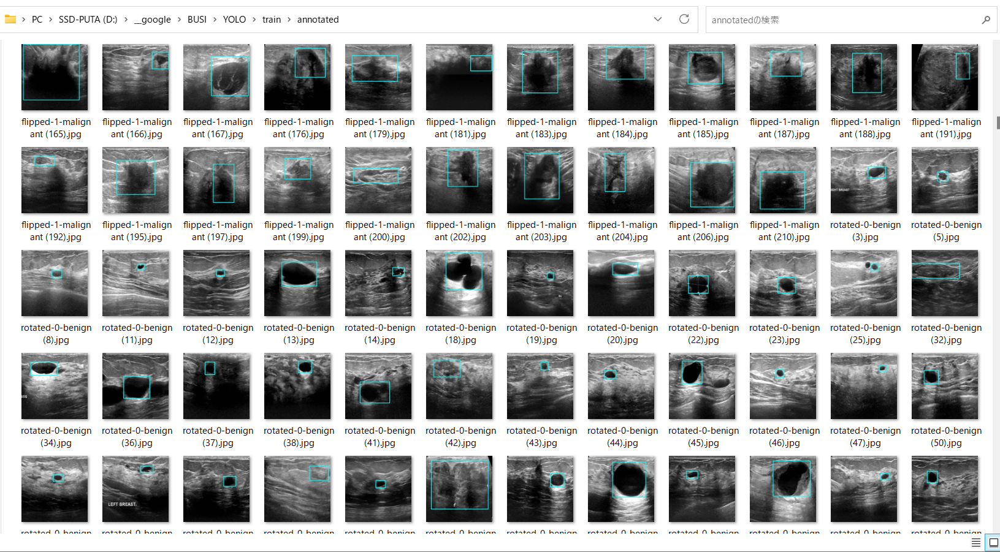

<h2> YOLO-Breast-UltraSound-Images (Updated: 2023/04/14)</h2>

This is a simple tool to create YOLO BUSI (Breast UltraSound Images) Dataset from a BUSI Dataset 
with mask images (segmentations).

The original BUSI Datasset used here has been taken from the following web site: 

<b>Dataset-BUSI-with-GT</b> 
<pre>
https://www.kaggle.com/datasets/aryashah2k/breast-ultrasound-images-dataset
</pre>

About Dataset
Breast cancer is one of the most common causes of death among women worldwide. 
Early detection helps in reducing the number of early deaths. 
The data reviews the medical images of breast cancer using ultrasound scan. 
Breast Ultrasound Dataset is categorized into three classes: normal, benign, 
and malignant images. 
Breast ultrasound images can produce great results in classification, detection, 
and segmentation of breast cancer when combined with machine learning.

<b>Citation:</b>
<pre>
Al-Dhabyani W, Gomaa M, Khaled H, Fahmy A. 
Dataset of breast ultrasound images. Data in Brief. 
2020 Feb;28:104863. 
DOI: 10.1016/j.dib.2019.104863.
</pre>

<h2>1 Clone repository</h2>
 Please clone this repostory to your local PC. 
<pre>
>git clone https://github.com/sarah-antillia/YOLO-Breast-UltraSound-Images.git
</pre>

<h2>2 Dataset_BUSI_with_GT</h2>
Please download image dataset from the following, and expand it under your local 
repository <b>YOLO-BreastSound-Images</b>
<pre>
https://www.kaggle.com/datasets/aryashah2k/breast-ultrasound-images-dataset
</pre>

<pre>
YOLO-BREAST-ULTRASOUND-IMAGES
└─Dataset_BUSI_with_GT
</pre>

<h2>3 Create master dataset</h2>

Please run the following command to create master dataset. 
<pre>
>python create_augmented_master_512x512.py
</pre>

<a href="./create_augmented_master_512x512.py">This create_augmented_master_512x512.py</a> will create <b>BUSI_augmented_master_512x512</b> folder which contains <b>test, train, and valid</b> datasets from <b>Dataset_BUSI_with_GT</b>. 
<pre>
./BUSI_augmented_master_512x512/
├─test/
│  ├─benign/
│  └─malignant/
├─train/
│  ├─benign/
│  └─malignant/
└─valid/
    ├─benign/
    └─malignant/
</pre>

1 This splits the original <b>Dataset_BUSI_with_GT</b> dataset to three subsets train, test and valid. 
with the ratios.

<pre>
 train: 0.5
 test:  0.3
 valid: 0.2
</pre>

2 Resize each image to 512x512

3 Augment each image in train dataset by rotating an angle in the following range ANGLES, and save the image as a jpg file.a

<pre> 
ANGLES = [0, 30, 60, 90, 120, 150, 180, 210, 240, 270, 300, 330]
</pre>

4 Flip horizontally and vertically each image in <b>train</b> dataset, and save the image as a jpg file.

5 Save each image in <b>test</b> dataset as a jpg file without any augmentation.

6 Save each image in <b>valid</b> dataset as a jpg file without any augmentation.

<h2>4 Create YOLO annotation</h2>
Please run the following command to create YOLO annotation from <b>BUSI_augmented_master_512x512</b>. 
<pre>
>python create_yolo_annotation_from_augmented_master.py
</pre>
<a href="./create_yolo_annotation_from_augmented_master.py">This create_yolo_annotation_from_augmented_master.py</a> will create <b>YOLO</b> folder which contains <b>test, train, and valid</b> YOLO annotations
 from <b>BUSI_augmented_master_512x512</b> dataset. 

<pre>
./YOLO/
├─test/
├─train/
└─valid/
</pre>

<b>Sample YOLO annotation in train:</b>
 
 

